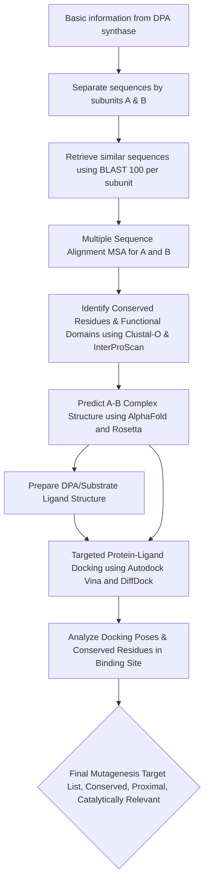

# Enzimatic engineering of DPA synthase from DPAHelix project

This repository corresponds to one of the five computational biology analyses of the DPAHelix project in the GOGEC Competition of 2026.

> **Objective**: Improve the catalytic activity of DPA synthase through multiple alignment, molecular docking and directed mutagenesis.

We worked using VS Code, along with the WSL extension (Ubuntu 22.04) as our development environmnet (Only-Windows users).

1. WSL Installation: https://learn.microsoft.com/en-us/windows/wsl/install
2. VS Code Installation: https://code.visualstudio.com/docs/setup/windows#_install-vs-code-on-windows
3. WSL extension on VS Code: https://code.visualstudio.com/docs/remote/wsl

## Workflow



## Activity 1: Identify available functional and annotated metadata

We accessed to enzymatic-related databases to retrieve all available information regarding DPA synthase (IUBMB, Rhea, BRENDA, UniProt, PDB). We first identified general metadata of the enzyme for later search:

- **EC Nomenclature**: 1.3.1.- (through UniProt database)
- **RHEA Number**: RHEA:47092 (through RHEA database)
- **Alternative names**: _spovF_, _dpaA_, _dpaB_, _spoVFA_, _spoVFB_, dipicolinate synthase, dipicolinic acid synthetase (through UniProt database)

_DPA Synthase is an oxidoreductase that catalyzes a dehydrogenation reaction on a C-CH group of its substrate, using NAD⁺ or NADP⁺ as an electron acceptor, to form dipicolinic acid (DPA)._

It is worth noting the dash as a fourth number in the EC nomenclature. There might be some uncertainty about its precise substrate specificity or mechanistic details for a final classification.

Considerations:

- Since there isn't a specific EC number for DPA synthase, we were unable to identify any quantitative, catalytic information in BRENDA database.
- Using the Rhea number of the reaction, we identified 155 DPA synthase-related entries in UniProt. These sequences naturally separated into two distinct groups corresponding to subunit-A and subunit-B. Notably, only one sequence corresponded to subunit A, with the remaining 154 corresponding to subunit B, suggesting a significant data imbalance.
- There are only two PDB structures available for each specific subunit (e.g., two for A and two for B), and none are bound to DPA or its precursor.

## Activity 2: Retrieve similar sequences using NCBI-BLAST

Given the lack of available data regarding quantitative catalytic information or a list of active site amino acids of the DPA synthase in the selected databases, we modified our objective **to identify potential catalytically relevant amino acids using comparative bioinformatics.** The identified highly conserved residues will serve as the candidate list for targeted mutagenesis experiments to improve catalytic activity.

We accessed to NCBI and identified template sequences of subunit A (GenBank: SPY12701.1) and subunit B (GenBank: TODO) from _Bacillus subtilis_. Each template was queried in Protein-BLAST to identify similar sequences. The results provided a table of 100 sequences per each subunit.

## Activity 3: Multiple Sequence Alignment (MSA) and InterProScan

A MSA through Clustal-Omega was performed separately for each subunit by aligning the _B. subtilis_ template sequence with the respective 100 homologous sequences retrieved via BLAST.This analysis aims to identify potential conserved regions and functionally critical residues. We installed Clustal-Omega using the following commands:

```shell
sudo apt-get update
sudo apt-get install clustalo
```

TODO: Add image

Additionally, we ran the InterProScan tool to identify conserved functional domains within DPA synthase. For this analysis, we queried our _B. subtilis_ subunit-A and subunit-B sequences separately, using the top 10 most homologous sequences retrieved from the previous BLAST searches as supplementary context for domain identification.

TODO: Add information and image from InterPro

## Activity 4: Predict A-B Complex Structure using AlphaFold and Rossetta

